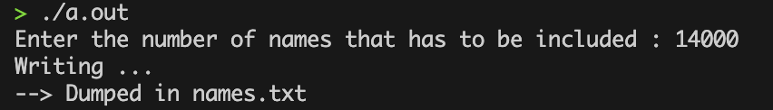
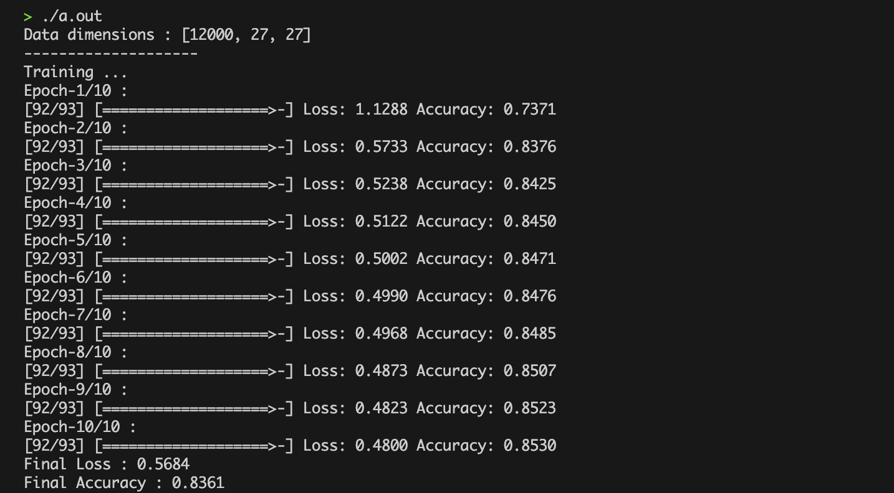
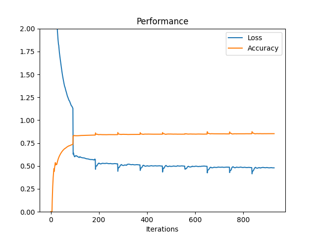
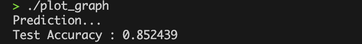

# LSTM Scratch Implementation

This repository contains a scratch implementation of Long Short-Term Memory (LSTM) networks in C++. The project aims to help understand the inner workings of LSTMs by building them from the ground up without using high-level libraries. The LSTM model is trained for a character-level recognition task using a baby names dataset from Kaggle.

## Features

- Implementation of LSTM from scratch in C++ (It includes Embedding layer for input embedding and Output passed through a softmax function).
- Custom dataset loading and preprocessing.
- Training and evaluation scripts.
- Visualization of training metrics.


## File Structure

- `data/`: Contains the dataset files.
- `pretrained/`: Directory for saving pretrained models.
- `dataset.cpp`: Handles dataset loading and preprocessing.
- `utils.cpp`: Collects the first n samples from the dataset and handles name preprocessing and encoding.
- `model.cpp`: Contains the LSTM model implementation, including initialization, forward propagation, backward propagation, parameter optimization, and loss & metrics calculation.
- `train.cpp`: Script for training the LSTM model and saving weights and metrics.
- `plot.cpp`: Handles visualization of training metrics using matplotlib.

## Installation

### Prerequisites

- C++ compiler (supporting C++17)
- CMake
- Matplotlib (for C++)

### Setup Instructions

1. **Clone the repository:**
   ```sh
   git clone https://github.com/binguliki/LSTM-Scratch-Implementation.git
   cd LSTM-Scratch-Implementation
   ```

2. **Prepare the dataset:**
   ```sh
   cd data
   g++ utils.cpp -std=c++17 -o utils
   ./utils
   cd ..
   ```

3. **Train the model:**
   Adjust the number of training instances if necessary, then compile and run the training script.
   ```sh
   g++ train.cpp -std=c++17 -o train
   ./train
   ```

   Note: Training might take up to 10-15 minutes.

4. **Plot the training metrics:**
   Update the paths in `CMakeLists.txt` according to the Python installation on your system.
   ```sh
   cd build
   cmake ..
   make
   ./plot_graph
   ```

   Make sure to replace file paths where necessary.

## Usage

1. **Load and preprocess the dataset:**
   The `utils.cpp` file is used to load the first n samples from the dataset and preprocess them into one-hot vector representations.

2. **Train the LSTM model:**
   The `train.cpp` file handles the training process, saving weights and metrics of the trained model.

3. **Visualize training metrics:**
   The `plot.cpp` file uses a matplotlib wrapper to visualize the performance of the model during training and print the test accuracy.

## Pretrained Model
The model has been trained on 12,000 instances and tested on 2,000 instances. The weights of the trained model are provided in the pretrained/ directory.

## Future Contributions
- Planning to integrate GPU inference and training, using CUDA.
- Finetune over a good dataset , to address tasks like poem generation.
  
## Images
1. Utils file Output: <br>
</img>

2. Training Output: <br>
</img>

3. Performance <br>
</img>

3. Testing Output <br>
</img>

## Contributing

Contributions are welcome! Please open an issue or submit a pull request for any improvements or bug fixes.
